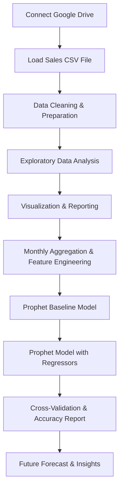
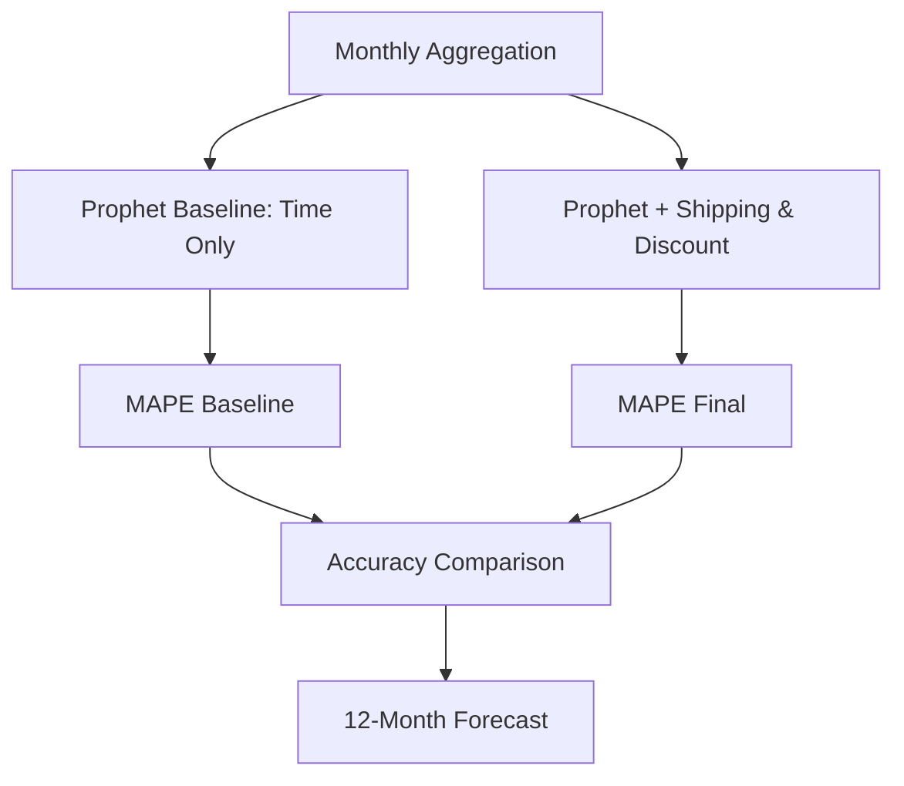

# Strategic Sales Analysis & Time-Series Forecasting Model

This repository presents a comprehensive data analysis and forecasting workflow for strategic sales management. It includes **exploratory data analysis (EDA)**, interactive visualizations, and advanced **time-series forecasting** using Facebook Prophet. The workflow is ideal for business analysts, data scientists, and professionals aiming to derive actionable insights from sales data and build robust revenue forecasts.

---

## Project Overview

This project demonstrates a full-cycle sales analytics pipeline:
- Data loading and cleaning
- KPI calculations and business reporting
- Interactive visualizations
- Advanced time-series forecasting with external regressors

The process is showcased using a **Global Superstore sales dataset** stored on Google Drive. The notebook is structured for easy adaptation to similar business datasets.

---

## Project Architecture

The following diagram outlines the high-level workflow from data ingestion to actionable forecasting:



---

## Data Loading and Preparation

The workflow starts by **mounting Google Drive** and loading the sales dataset.

### Steps:
- Connect to Google Drive from Google Colab.
- Load the CSV file using `pandas`.
- Display head, info, and descriptive statistics.
- Convert date columns to datetime.
- Drop duplicates and handle missing values.

```python
from google.colab import drive
import pandas as pd

drive.mount('/content/drive')
df = pd.read_csv("/content/drive/MyDrive/Global_Superstore2.csv", encoding="latin1")
df['Order Date'] = pd.to_datetime(df['Order Date'], dayfirst=True, errors='coerce')
df['Ship Date'] = pd.to_datetime(df['Ship Date'], dayfirst=True, errors='coerce')
df.drop_duplicates(inplace=True)
df.drop(columns=['Postal Code'], inplace=True)
```

---

## Exploratory Data Analysis & KPI Calculation

The code computes essential **sales KPIs** and segments sales data for further analysis.

### Key KPIs:
- **Total Sales**
- **Total Profit**
- **Average Discount**
- **Total Quantity Sold**
- **Average Shipping Cost**
- **Total Unique Orders**

Additionally, it provides **sales by category**, **sales by region**, and **monthly sales trends**.

```python
total_sales = df['Sales'].sum()
total_profit = df['Profit'].sum()
average_discount = df['Discount'].mean()
total_quantity = df['Quantity'].sum()
average_shipping_cost = df['Shipping Cost'].mean()
total_orders = df['Order ID'].nunique()

print(f"Total Sales: {total_sales:,.2f}")
print(f"Total Profit: {total_profit:,.2f}")
print(f"Average Discount: {average_discount:.2%}")
print(f"Total Quantity Sold: {total_quantity}")
print(f"Average Shipping Cost: {average_shipping_cost:.2f}")
print(f"Total Unique Orders: {total_orders}")
```

---

## Interactive Visualizations

Visualization enables intuitive understanding of sales dynamics. The following plots are generated:

- **Sales by Category (Bar Chart)**
- **Monthly Sales Trend (Line Graph)**
- **Sales by Region (Pie Chart)**
- **Profit vs Discount (Scatter Chart)**

```python
import matplotlib.pyplot as plt

# Bar Chart: Sales by Category
df.groupby('Category')['Sales'].sum().plot(kind='bar')
plt.title('Sales by Category')
plt.xlabel('Category')
plt.ylabel('Total Sales')
plt.show()

# Line Graph: Monthly Sales Trend
monthly_sales = df.resample('M', on='Order Date')['Sales'].sum()
monthly_sales.plot(kind='line')
plt.title('Monthly Sales Trend')
plt.xlabel('Month')
plt.ylabel('Sales')
plt.show()

# Pie Chart: Sales by Region
df.groupby('Region')['Sales'].sum().plot(kind='pie', autopct='%1.1f%%')
plt.title('Sales by Region')
plt.ylabel('')
plt.show()

# Scatter Chart: Profit vs Discount
df.plot(kind='scatter', x='Discount', y='Profit')
plt.title('Discount vs Profit')
plt.show()
```

---

## Time-Series Forecasting with Prophet

The project leverages **Facebook Prophet** for robust sales forecasting, including the effects of external business drivers such as shipping cost and discount.

### Setup and Preparation

- Install Prophet.
- Aggregate monthly data and create external regressor features.

```python
!pip install prophet
from prophet import Prophet
import warnings
warnings.filterwarnings('ignore')

monthly_data = df.set_index('Order Date').resample('MS').agg(
    y=('Sales', 'sum'),
    total_shipping_cost=('Shipping Cost', 'sum'),
    avg_discount=('Discount', 'mean')
).reset_index()

monthly_data.columns = ['ds', 'y', 'total_shipping_cost', 'avg_discount']
```

#### Feature Engineering Table

| Feature               | Description                                 |
|-----------------------|---------------------------------------------|
| ds                    | Month start date (datetime, Prophet format) |
| y                     | Total sales for the month                   |
| total_shipping_cost   | Sum of shipping cost per month              |
| avg_discount          | Mean discount per month                     |

---

## Baseline Model: Time-Only Forecast

The **baseline model** uses only time and seasonality, serving as a benchmark for improvement.

```python
from prophet.diagnostics import cross_validation, performance_metrics

model_baseline = Prophet(
    growth='linear',
    seasonality_mode='multiplicative',
    yearly_seasonality=True
)
model_baseline.fit(monthly_data[['ds', 'y']])
df_cv_base = cross_validation(
    model_baseline,
    initial='730 days',
    period='183.0 days',
    horizon='365 days'
)
df_p_base = performance_metrics(df_cv_base)
BASELINE_MAPE = df_p_base['mape'].mean() * 100
print(f"BASELINE RESULT (Time Only): {BASELINE_MAPE:.2f}% MAPE")
```

---

## Advanced Model: With External Regressors

The enhanced model adds **total shipping cost** and **average discount** as external regressors, substantially improving accuracy.

```python
model_reg = Prophet(
    growth='linear',
    seasonality_mode='multiplicative',
    yearly_seasonality=True
)
model_reg.add_regressor('total_shipping_cost')
model_reg.add_regressor('avg_discount')
model_reg.fit(monthly_data)
```

#### Model Training and Validation

- **Cross-Validation** compares the regressor model with the baseline.
- **MAPE** (Mean Absolute Percentage Error) is used for accuracy assessment.

```python
df_cv_reg = cross_validation(
    model_reg,
    initial='730 days',
    period='183.0 days',
    horizon='365 days'
)
df_p_reg = performance_metrics(df_cv_reg)
FINAL_MAPE = df_p_reg['mape'].mean() * 100

print("--- FINAL MODEL ACCURACY COMPARISON (1-Year Forecast) ---")
print(f"BASELINE Model (Time Only): {BASELINE_MAPE:.2f}% MAPE")
print(f"FINAL Model (Time + Regressors): {FINAL_MAPE:.2f}% MAPE")
print(f"✅ IMPROVEMENT: {BASELINE_MAPE - FINAL_MAPE:.2f} percentage points.")
```

---

## Future Sales Forecast & Visualization

Generate a **12-month actionable forecast** using the trained model:

```python
# Generate next 12 months (future dataframe)
future = model_reg.make_future_dataframe(periods=12, freq='MS')
future['total_shipping_cost'] = monthly_data['total_shipping_cost'].mean()
future['avg_discount'] = monthly_data['avg_discount'].mean()

# Predict
forecast = model_reg.predict(future)

# Plot forecast
fig = model_reg.plot(forecast)
plt.title(f'Highly Accurate Sales Revenue Forecast (MAPE: {FINAL_MAPE:.2f}%)')
plt.xlabel('Date')
plt.ylabel('Sales Revenue')
plt.show()

# Display forecast table for next 12 months
print(forecast[['ds', 'yhat', 'yhat_lower', 'yhat_upper']].tail(12).round(0))
```

---

## Model Pipeline Overview



---

## Key Benefits & Insights

- 📈 **Automated KPI Reporting:** Quickly surface sales trends and business performance.
- 🤖 **Advanced Forecasting:** Leverage modern time-series modeling with interpretable features.
- 🚀 **Actionable Outputs:** Ready-to-use forecasts empower data-driven decision-making.

```card
{
    "title": "Best Practice Tip",
    "content": "Always validate time-series models with cross-validation and compare baseline with advanced regressor models for real-world forecasting."
}
```

---

## Customization & Adaptation

You can easily adapt this workflow to your own sales datasets:
- Replace the CSV path and column names as needed.
- Add or remove regressors based on your business context.
- Extend visualizations for deeper business insights.

---

## Requirements

- Python 3.x (tested in Google Colab)
- `pandas`, `numpy`, `matplotlib`
- `prophet` (install with `pip install prophet`)

---

## Conclusion

This project showcases an end-to-end solution for **strategic sales analytics and forecasting**. It delivers both **business intelligence** and **predictive power** for robust commercial planning.

---

## License

This project is released under the MIT License.

---

## Author

Feel free to reach out if you want to discuss data science, analytics, or forecasting projects!

---

## 🌟 Why Hire Me?

- Expert in advanced analytics and machine learning.
- Proven track record of delivering actionable business insights.
- Professional, efficient, and results-driven.

---

**Ready to drive your business forward with data? Let's connect!**